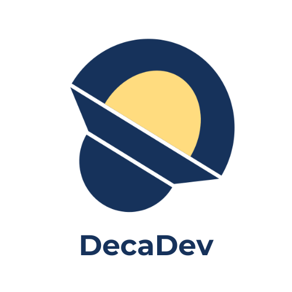

# DecaDev Project

## About Us

PM: Della Anissa Putri Widodo  
UI/UX: Ridhaka Gina Amalia, Gilang Nur Hidayat  
Front End: Achmad Zainun Qurthubi, Desta Rizky Andhika  
Back End: M. Denny Tri Lisandi, faqih Rofiqi  
Data Science: Calvin Alexander, M. Andrian Bhakti Maulana  
QA: Audry Maharani

**Filosofi**: "Deca" berarti sepuluh, mencerminkan jumlah anggota tim. Nama ini juga menekankan bahwa setiap orang dalam tim adalah developer handal yang berkontribusi penuh untuk mencapai kesuksesan bersama.

## cara clone
1. Clone the repo: git clone https://github.com/Koutsura/toko_buku_online.git
2. Run cd toko_buku_online
3. Run composer install command
4. Run composer require barryvdh/laravel-dompdf //untuk setting laravel install pdf
5. Run npm install command
6. Run npm run dev command
7. Run cp .env.example .env command
8. Run php artisan key:generate command
9. Run php artisan serve command
10. Masukkan database "db_buku" ada di folder database pada .env
11. Done
